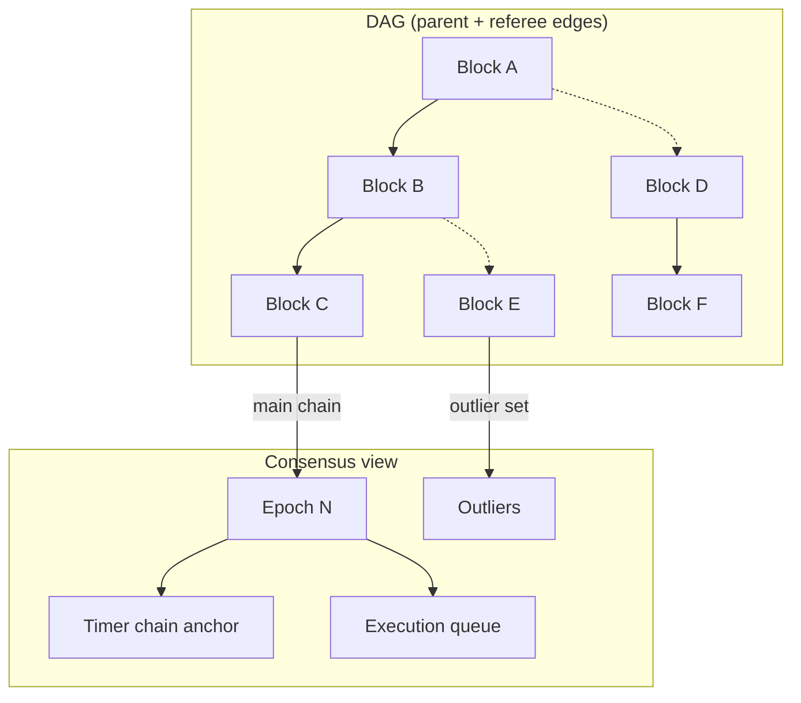

---
layout:
  title:
    visible: true
  description:
    visible: false
  tableOfContents:
    visible: true
  outline:
    visible: true
  pagination:
    visible: true
---

# Consensus

Consensus in Mazze is handled by `ConsensusGraph`, which sits on top of the
synchronization graph. It maintains the DAG-Embedded Tree Structure (DETS) and
implements the Timer Chain WLSR / Mazze ordering algorithm.

## ConsensusGraph responsibilities
- Accept ready blocks from the sync graph.
- Maintain the DETS view of the DAG.
- Compute an ordered sequence of epochs and the best block hash.
- Provide mining inputs (best info, terminal hashes, blame/state data).
- Dispatch epoch execution tasks.

## DAG/consensus view (mermaid)
Solid edges are parent links; dashed edges are referee links.

## Ordering and weights (Timer Chain WLSR)
The ordering algorithm blends two ideas:
- Weighted longest chain (WLSR) over the DAG to capture total work.
- Timer chain to anchor stable checkpoints.

Key parameters are configurable:
- `adaptive_weight_beta` and `heavy_block_difficulty_ratio` determine adaptive
  weighting for heavy blocks.
- `timer_chain_block_difficulty_ratio` and `timer_chain_beta` govern timer
  chain selection.
- `era_epoch_count` defines checkpoint spacing.

## Outliers, adaptive blocks, and partial invalidity
When a block arrives, consensus computes its outlier set (blocks in the future
of its parent view) and derives an adaptive weight. Blocks that choose an
incorrect parent or carry an incorrect adaptive flag are marked partial
invalid. Partial invalid blocks remain in the DAG but are excluded from rewards
and ordering.

## Epochs and eras
- An epoch is the ordered block set associated with a main-chain block.
- An era is a contiguous range of epochs used for checkpointing and pruning.
- `cur_era_genesis` and `cur_era_stable_height` define the active era window.

Consensus dispatches execution by epochs, and execution is deferred to reduce
reorg churn.

## Checkpoints and timer chain
The timer chain provides a stable anchor for era checkpoints. When a candidate
checkpoint is selected, the graph is trimmed to a new era while ensuring that
no timer-chain block sits in the outlier of the new genesis.

## Confirmation and mining readiness
`ConfirmationMeter` tracks confirmation depth for main-chain blocks. Once the
node enters the normal phase and the consensus graph is stable, the
`ready_for_mining` flag enables block generation.

## Key source files
- `crates/mazzecore/core/src/consensus/mod.rs`
- `crates/mazzecore/core/src/consensus/consensus_inner/mod.rs`
- `crates/mazzecore/core/src/consensus/consensus_inner/consensus_new_block_handler.rs`
