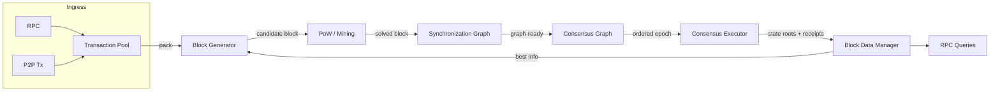

---
layout:
  title:
    visible: true
  description:
    visible: false
  tableOfContents:
    visible: true
  outline:
    visible: true
  pagination:
    visible: true
---

# Overview

Mazze Node is built as a collection of Rust crates wired together by the main
binary in `bins/mazze`. The runtime pipeline is:

1. Transactions arrive over RPC or P2P and enter the transaction pool.
2. The block generator asks the pool for a packable set of transactions and
   assembles a candidate block header/body.
3. Proof of Work (PoW) is computed locally or via Stratum workers.
4. The synchronization graph ingests headers and bodies and maintains the DAG
   connectivity.
5. The consensus graph (on top of sync) maintains the DAG-Embedded Tree
   Structure (DETS) and produces an ordered sequence of epochs.
6. The consensus executor executes epoch transactions and produces deferred
   state/receipt/logs roots.
7. Block and state data are persisted by the block data manager and storage
   manager.
8. RPC serves queries backed by the consensus graph, data manager, and state DB.

## Block flow (mermaid)

## Crate map (high level)
- `bins/mazze` - node entrypoint, wiring, and runtime services.
- `crates/mazzecore/core` - consensus, sync, txpool, verification, PoW.
- `crates/blockgen` - block assembly and mining orchestration.
- `crates/network` - P2P transport, discovery, peer management.
- `crates/dbs/storage` - state DB, snapshots, Merkle Patricia Trie.
- `crates/primitives` - block, header, tx, receipt primitives.
- `crates/client` - configuration and JSON-RPC handlers.
- `crates/stratum` - Stratum service implementation.
- `crates/transactiongen` - optional transaction generator for dev/test.

## Runtime loops
- Sync loop: drives the catch-up phases and fetches missing headers/bodies.
- Consensus loop: activates ready blocks, updates ordering, and emits epochs.
- Execution loop: runs in a worker thread and commits epoch results.
- Mining loop: assembles blocks, pushes PoW problems, and submits solutions.
- RPC loop: exposes state/block/txpool APIs and tracing.

## End-to-end data flow (compressed)
- New tx -> `TransactionPool` -> `PackingPool` -> `BlockGenerator`.
- New block header -> `SynchronizationGraph` -> body fetch -> `ConsensusGraph`.
- Ordered epoch -> `ConsensusExecutor` -> roots/receipts -> `BlockDataManager`.
- Persisted data -> RPC queries and mining inputs.

## Key source files
- `crates/mazzecore/core/src/consensus/mod.rs`
- `crates/mazzecore/core/src/sync/synchronization_graph.rs`
- `crates/mazzecore/core/src/consensus/consensus_inner/consensus_executor/mod.rs`
- `crates/mazzecore/core/src/transaction_pool/mod.rs`
- `crates/blockgen/src/lib.rs`
- `crates/dbs/storage/src/lib.rs`
- `crates/client/src/rpc/impls/mazze/mazze_handler.rs`
