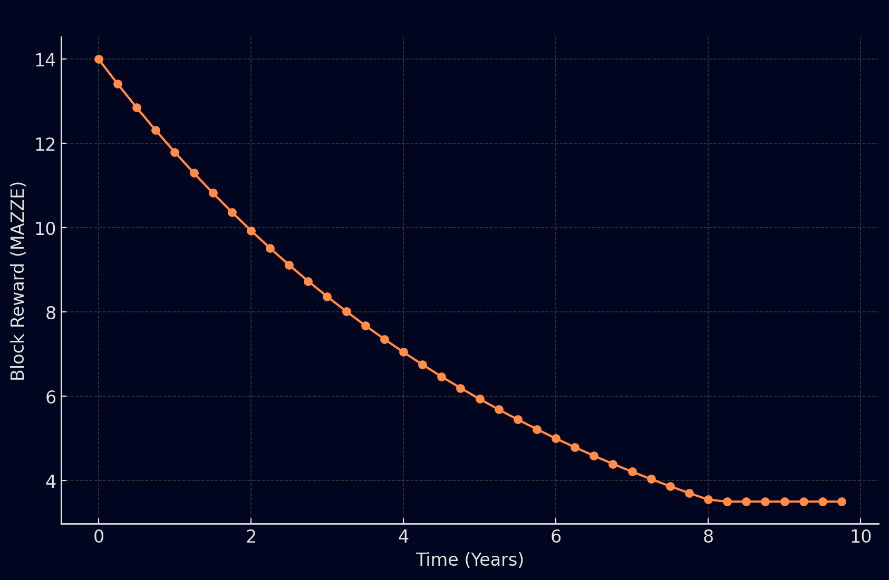
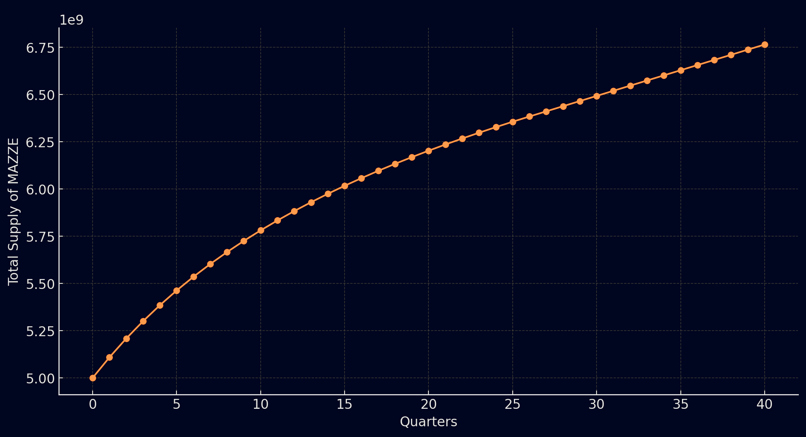

---
layout:
  title:
    visible: true
  description:
    visible: false
  tableOfContents:
    visible: true
  outline:
    visible: true
  pagination:
    visible: true
---

# Inflation

The Mazze blockchain addresses inflation through its unique economic model and block reward system. Here's a detailed breakdown:

### <mark style="color:orange;">**Inflation Control Mechanism**</mark>

*   **Block Reward Calculation** | Miners receive rewards for each block mined, with the total daily block rewards determined by the network's block generation rate (one block per second, leading to 86,400 blocks daily). The annual new token issuance (B × D × 365) for miner rewards introduces inflation by expanding the monetary base.

    **Formula for Block Reward**: To align with a targeted annual inflation rate $$(r  b) ​$$, the block reward (B) is calculated as $$B=  G⋅r  b/365⋅D  ​$$, where G represents the total genesis tokens and D is the total number of blocks mined daily.
* **Annual Inflation Rate** | The inflation rate starts at an initial rate of 8.836% and decreases quarterly by a factor of 0.958, mirroring mechanisms like Bitcoin's halving to manage new MAZZE tokens entering the system and support the token's value over time.

### <mark style="color:orange;">**Graphical Representations**</mark>

* **Annual Inflation Rate for the First 10 Years** | This chart illustrates the designed decline in the annual inflation rate, showcasing the blockchain's strategy to reduce inflation steadily over a decade.

<figure><figcaption>
Annual Inflation Rate (First 10 Years)
</figcaption></figure>

* **Block Reward Decline over the First 10 Years** | Depicting the decrease in MAZZE awarded per block, demonstrating a halving effect roughly every four years to ensure a deflationary token supply policy.

<figure><figcaption>
Block Reward Decline (First 10 Years)
</figcaption></figure>

* **Total Supply Growth of MAZZE over 10 Years** | A comprehensive view of the MAZZE token supply increase, taking into account the inflation rate and decreasing block rewards. This curve highlights the predictable yet declining growth rate, a common strategy in cryptocurrencies to enhance long-term sustainability and value retention.

<figure><figcaption>
Total Supply of MAZZE (First 10 Years)
</figcaption></figure>

### <mark style="color:orange;">**Impact of Inflation on the Economy**</mark>

The Mazze blockchain's inflation model is meticulously designed to balance new token creation with economic incentives for miners and token holders. By adjusting block rewards and modeling inflation rates, Mazze aims to encourage network security and participation while gradually transitioning to a more stable token economy. This approach not only secures the network but also aims at a fair distribution of rewards, thereby ensuring the long-term viability and value of the MAZZE token.

Mazze's innovative approach to managing inflation through its tokenomics and reward systems demonstrates a sophisticated understanding of blockchain economy dynamics. The phased reduction in block rewards and carefully calibrated inflation rate are central to Mazze's strategy for creating a stable and sustainable economic model that benefits miners, token holders, and the broader ecosystem.
